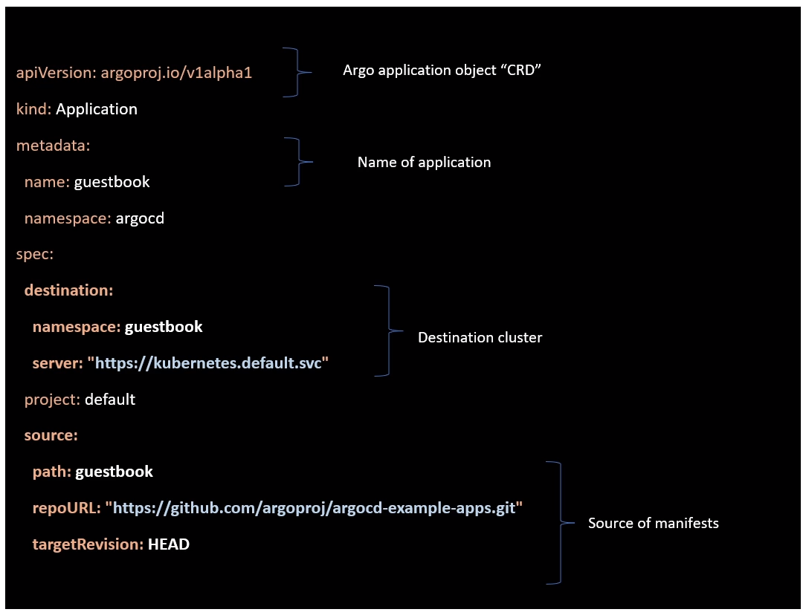
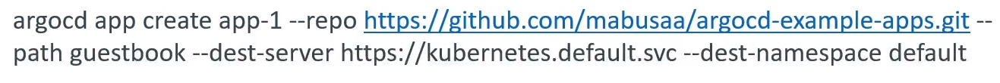
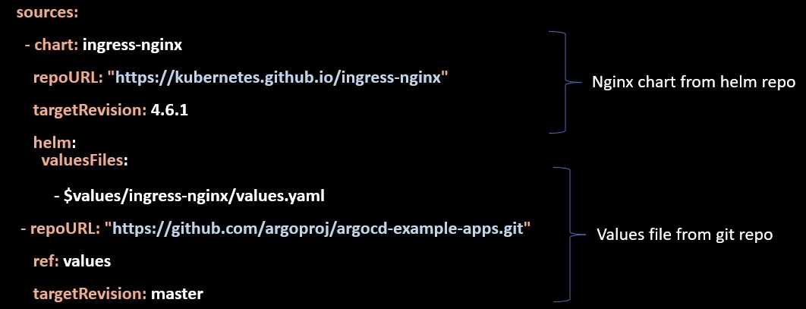

## ArgoCD Application

- Application is Kubernetes resource object representing a deployed application instance in an environment.
- It is defined by two key pieces of information:
  - Source: reference to the desired state in Git (repository, revision, path)
  - Destination: reference to the target cluster and namespace
- Applications can be created using below options:
  - Declarative "Yaml" (recommended)
  - Web UI
  - CLI

## How ArgoCD detects tools

- If you don't specify a tool explicitly then it's detected as follows:
  - Helm charts: if there is a file as Chart.yaml
  - Kustomize: if there is a kustomization.yaml, kustomization.yml, or Kustomization
  - Otherwise it is assumed to be a plain Yaml directory application.

- Note: by default in Argo CD, helm release name is equal to app name unless we specify it explicitly. 

## Multiple source for an Application

- Before ArgoCD 2.6, we can only specify a single source per application. It can either git repo or helm repo.
- ArgoCD implemented the feature, multiple sources per application in version 2.6
- ArgoCD application kind has a "sources" field where we can specify multiple sources.
- When you use "sources" field, ArgoCD will ignore "source" field.
- If multiple sources produce the same resource (same group, kind, name, and namespace), the last source to produce the resource will take precedence.

### Use cases

1. Combine related resources that exist in different repos into one application
   eg: We can install redis chart as source1 and redis prometheus exporter chart from source2. deploy these into one application rather than two.
2. Remote helm chart with git-hosted values
   eg: Suppose we want to deploy nginx ingress controller using helm chart and take some values from a git repo.

