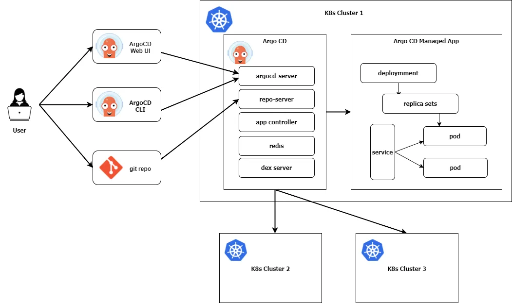

## ArgoCD Architecture

ArgoCD consists of 3 main components and they are running as pods in K8s cluster.

- ArgoCD server (API + Web server)
- ArgoCD Repo server
- ArgoCD Application controller

### API - Web server

It's a gRPC/REST server which exposes the API consumed by the Web UI, CLI and manages the following. The Web UI, CLI, and other gRPC/REST APIs are communicating with this server.

- Application management (Create, Update, Delete)
- Application operations (Sync, Rollback)
- Repos and clusters management
- Authentication

### Repo server

Its an internal service responsible for cloning the remote git repos and generate the needed k8s manifests.

### Application controller

Its a Kubernetes controller which continuously monitors running applications and compares the current, live state against the desired target state.
- Communicates with Repo server to get the generated manifests
- Communicate with K8s API to get the actual cluster state
- Deploy apps manifests to destination clusters
- Detects OutofSync Apps and take corrective actions if needed
- Invoking user-defined hooks for lifecycle events (PreSync, Sync, PostSync)

### Additional components

- Redis: used for caching
- Dex: identity service to integrate with external identity providers, eg: GitHub
- ApplicationSet Controller: It automates the generation of Argo CD applications
