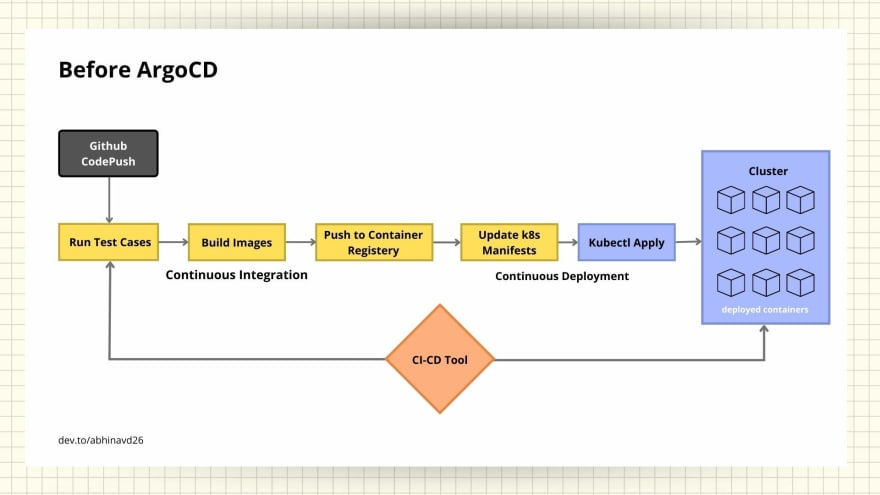
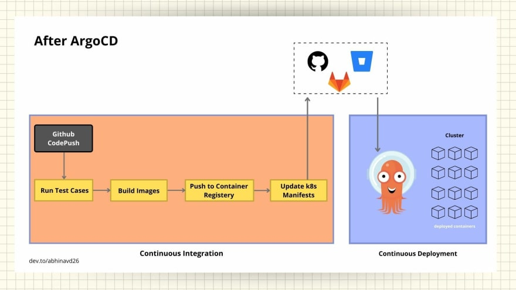

## What is ArgoCD?

ArgoCD is a Kubernetes-native continuous deployment (CD) tool. Unlike external CD tools that only enable push-based deployments, Argo CD can pull updated code from Git repositories and deploy it directly to Kubernetes resources. It enables developers to manage both infrastructure configuration and application updates in one system.

There are many features of ArgoCD :

1. Whole Kubernetes configuration defined as code in GIT Repository.
2. Web user interface and command-line interface (CLI).
3. It has easy rollback mechanism through which we can rollback our changes to any previous state.
4. It has cluster disaster recovery feature which helps to create the exact cluster if cluster dies because all codes are present in GIT.
5. More security: Grant access to ArgoCD only.
6. Keep your cluster in sync with git.

##  Workflow Before ArgoCD 

Before the existence of ArgoCD, the pipeline seems something like the image above. A common ci-cd tool is used for both the Continuous Integration and Continuous Deployment.

- once the code is being pushed to version-control let's say Github, the tool triggers the other jobs
- it runs the test-cases, build images, push the image to respective container registry
- then changes the deployment manifests as per the new image build, and then deploy the new manifest using kubectl commands

All these jobs/tasks are being performed by a ci-cd tool. This is how traditional ci-cd workflow works before the existence of ArgoCD. However there are some challenges in this workflow.

- We need to install and configure tools like kubectl, helm, etc in the ci-cd tools
- We will have to provide access to k8s cluster and cloud providers if using managed services like eks to the respective ci-cd tool
- It may lead to security loopholes as credentials are provided to external tools
- There's no visibility of deployment metrics, your ci-cd tools doesn't know the status of deployed application once they apply the manifests

## Workflow After ArgoCD
 

After the ArgoCD was launched in the market, the complete workflow has been changed. As you can see in the image, the Continuous Integration and Continuous Deployment has been separated now. ArgoCD uses declarative GitOps based deployment which states that the best practices is to have two different git repositories, one for application source code and another for deployment manifest files. 
- once the code has been pushed to version, the CI pipeline trigger the job
- starts to run test cases, build images, push images to respective container registry and then update the manifest according and push manifests to its respective git repository
- once the updated manifests is pushed to its respective repository be it Github, Gitlab, etc as shown in the image, ArgoCD installed within the cluster automatically checks for the updates and apply within the cluster.

This is how, the respective ci-cd tool is limited to CI and ArgoCD handles the CD part and thus separating both the operations.

## Core concepts

- **Application**: A group of Kubernetes resources as defined by a manifest.
- **Application source - tools**: ArgoCD supports the below tools as source
    - Helm charts
    - Kustomize application
    - Directory of Yaml files
    - Jsonnet
- **Project**: Projects provide a logical grouping of applications. Useful when ArgoCD is used by multiple teams.
    - Allow only specific sources "trusted git repos"
    - Allow apps to be deployed into specific clusters and namespaces
    - Allow specific resources to be deployed "deployments, statefulset...etc"
    - Specifying project is mandatory, Argo CD creates a default project that you can use.
- **Target/Desired state**: The desired state of an application, as represented by files in a Git repository.
- **Live/Actual state**: The live state of that application. What pods etc are deployed.
- **Sync**: The process of making desired state = actual state
- **Refresh (Compare)**: Compares the latest code in Git with the live state. Figure out what is different. ArgoCD automatically refreshes every 3 minutes.
