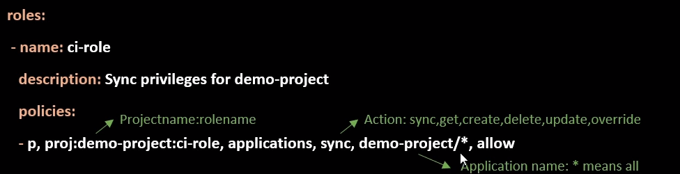

## Why Projects?

- **Application grouping**
  - Provides logical grouping of applications
- **Access restrictions**
  - Useful when ArgoCD is used by multiple teams
    - Allow only specific sources "trusted git repos"
    - Allow apps to be deployed into specific clusters and namespaces
    - Allow specific resources to be deployed, "deployments, statefulsets...etc"
- **Project Roles feature**
  - Enables you to set a role with set of policies "permissions" to grant access to a project's applications
  - You can use it to grant CI system a specific access to project applications. It must be associated with JWT
  - You can use it to grant oidc groups a specific access to project applications
- **Default project**
  - ArgoCD creates a default project once you install it

  - You can create project in three ways; Using declarative method, web ui, and cli.

## Project roles


- Project roles is not useful without generating a JWT
- Generated tokens are not stored in ArgoCD
- To create a token using CLI
  ```argocd proj role create-token PROJECT ROLE-NAME```
- A user can leverage tokens in the cli by either passing them in using the --auth-token flag or setting the ARGOCD_AUTH_TOKEN env variable
  ```argocd cluster list --auth-token token-value```
